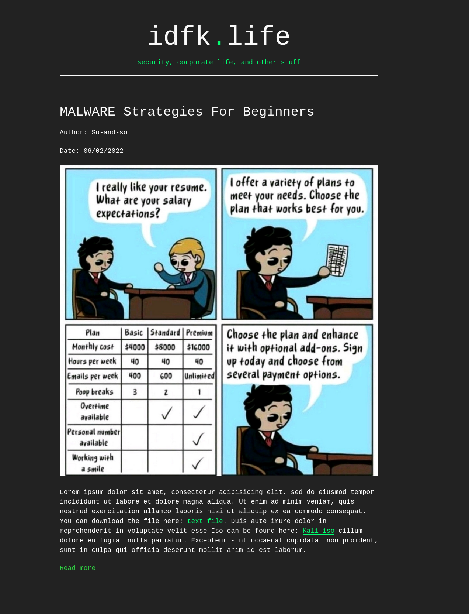

## A minimalist python blog

This is a minimal, static site generating, blog framework.
The idea is that you write your articles locally in markdown (including any assets such as  images, files, and the like), and then `scp` these files up to a remote web server to a specific directory watched on a schedule by the `blog.py` file. The `blog.py` file then handles the heavy lifting (in actuality, not heavy at all) of converting your markdown article into html, linking included assets, and adding an article preview to the landing page of your blog as well as the full article itself.

Why a static generated site? What is a statically generated site?

A statically generated site is a site where all content on a site is static (immutable) and was generated by a trustworthy entity (almost always, a script) around one or more templates. This is the opposite of dynamic (sites), where end users can directly interact with your site's content, as well as modify, add, and remove it. 

There are multiple benefits to this type of site. The first being security. There are no databases, no users, no forms, no logins, and no server side code to handle requests. The web-server just serves static content. The second benefit is performance. All site content is static - meaning that webpages should load quickly given their light, very low dependence on outside assets nature. The third benefit is simplicity. `blog.py` is a sub 200 line script that handles the generating of blog content. If it had to account for user interaction, protection, and the like, it would be much, much, larger. 

### Screenshots


> meme credit: [here](https://www.reddit.com/r/ProgrammerHumor/comments/pcgrcx/eaas_aka_employee_as_a_service_choose_your_package/)

### Getting Started

#### Prerequisites

Be sure to have `python3` and `pip` installed. You will also need a webserver installed such as `nginx`, `apache`, or `Microsoft IIS` to serve your blog.

#### Main Installation

There are two types of installations, local and server.
 - A local installation is meant for development testing, or proofing posts before being made public.
 - A server installation is meant to make posts public on a deployed server.

Ideally, the recommended method of installation is to have both a local deployment, and a server deployment - proofing and viewing posts in a local installation, and them pushing them to the prod installation once you are happy.

Alternatively, you can write raw markdown posts in some folder, and then push them up to a server installation as well.

Considerations between installation types:

Directory structure differs between installation type. Local installations build the blog in a single folder. Server installations separate the public post directory from where logs, the main `blog.py` script, and your original markdown posts are kept - these are obviously not meant to be public.

The below instructions outline the setup process:

1. Create a directory in which you want to work on blog development. For example if you are running a linux environment, you might create a directory `~/projects/blog/`. In this case you would run

    ```
    ~$ mkdir ~/projects/blog/
    ```
 
    and then change directories into the one you just created
 
     ```
     ~$ cd ~/projects/blog/
     ```
 
2. Download the repo into this folder
    ```
    ~/projects/blog$ git clone <REPO>
    ```

    or

    ```
    ~/projects/blog$ wget <REPO.zip>
    ```

3. When extracted you should have the following files in the above folder:

    ```
    ~/Projects/blog $ tree .
    .
    ├── blog.py
    ├── index.html
    ├── README.md
    ├── requirements.txt
    └── styles.css

    0 directories, 5 files
    ```

- *blog.py* is the script that facilitates the blog setup, creation, and post process.
- *index.html* is the base website html template, which is used for the main landing page, and template for individual posts.
- *styles.css* the main site styling file. This is taken from the retro stylesheet found at https://markdowncss.github.io/. Feel free to replace this base styling with your own as needed.
- *requirements.txt* the required python dependencies (for which there are only two)
- *README.md* the readme file

4. Install the project dependencies with

    ```
    $ pip install -r requirements.txt
    ```

5. To run the blog setup, run the following:
    ```
    ~/Projects/blog $ python3 blog.py --setup [local|server]
    ```

    The blog setup process will allow you to specify if the installation is local or server.

    After the setup process is completed, your current directory should look as follows:

    If you opted for a **local** setup:

    ```
    ~/Projects/blog$ tree --dirsfirst .
    .
    ├── assets
    │   └── styles.css
    ├── logs
    ├── markdown-posts
    ├── posts
    ├── blog.py
    ├── config.json
    ├── index.html
    ├── README.md
    └── requirements.txt

    4 directories, 6 files
    ```

    4 new directories, as well as one additional file has been created.

    - *assets* will contain all files, images, etc., that you include with your blog post. So for example, if you create a new markdown post with embedded images, and files, they will be found here under a sub directory denoted by the title of your blog post. Also notice that the main styling for the site has been moved to this folder as well.
    - *logs* will contain rudimentary logs such as when a blog post was published or removed from the site.
    - *markdown-posts* this folder is to contain the blog articles you write in markdown. Each article you are working on should have it's own folder, ideally named the title of your article. 
    - *posts* is a folder containing finalized, html posts.
    - *config.json* contains directory path settings that specify where posts and assets will get stored

    If you opted for a **server** installation, the setup is slightly more interactive allowing you to specify where your web root is.

    Directory paths change slightly, due to the aforementioned security concerns and nature of hosting content on a production server.

    For example, if you are running an Nginx server on a Linux machine, the web root usually defaults to `/var/www/html/`. Using this path for the web root would yield the following installation structure:

    ```
    /var/www/html/
    .
    ├── assets
    │   └── styles.css
    ├── posts
    └── index.html


    ~/projects/blog/
    .
    ├── logs
    ├── markdown-posts
    ├── blog.py
    ├── config.json
    ├── README.md
    └── requirements.txt
    ```

6. The final step is to set up a cron job or scheduled task to handle making blog posts public. Ideally the script should be set to run every 5 minutes or so - see the below example cronjob entry.

    `*/5 * * * * python3 /path/to/blog.py`

    Notice the lack of options passed to the blog.py script. The script requires no options to handle the publication of blog posts.

    Additionally, remember the user that this scheduled task is filed under needs to have permission to execute the blog.py file, as well as write files to the web root. 

7. Finally, to publish blog posts, navigate to your local folder containing markdown posts. Given that each post should have its own folder (containing the markdown post, assets, etc.,), `scp` this local (post) folder to your remote server and into it's `markdown-posts` folder. 

    For example, if your local `markdown-posts` folder had the following content:

    ```
    LOCAL
    -----

    ~/projects/blog/markdown-posts/$ tree --dirsfirst .
    .
    ├── post1
    │ 	├── p1-1.png
    │ 	├── p1-2.png
    │   └── p1.md
    ├── post2
    │ 	├── p2-1.png
    │   ├── test.txt
    │   └── p2.md
    └──├── post3
       └── p3.md
    ```

    and you wanted to make post1 public, you would run the following command:

    `~/project/blog/markdown-posts/$ scp -r post1 <USER>@<REMOTE HOST>:~/project/blog/markdown-posts/`

    ```
    SERVER
    -------
       
    ~/projects/blog/
    .
    ├── logs
    ├── markdown-posts
    ├── blog.py
    ├── config.json
    ├── README.md
    └── requirements.txt
    ```

The cron job that runs the `blog.py` script continually watches the `markdown-posts/` directory for new content, converts the markdown post to html, moves relevant assets, and publishes them into the web server's root directory.


### Oddities

- Post updates can be made by re-uploading a post with the same title of a post that is already public. Article content can be changed, but the existing title must remain the same.
- You can also remove posts from your blog (posts that have already been made public) by logging into your server, navigating to the blog directory that contains the `blog.py` file, and running `python3 blog.py --remove-post "<TITLE OF POST>"`.
- Help can be accessed by running `python3 blog.py [-h|--help]`.